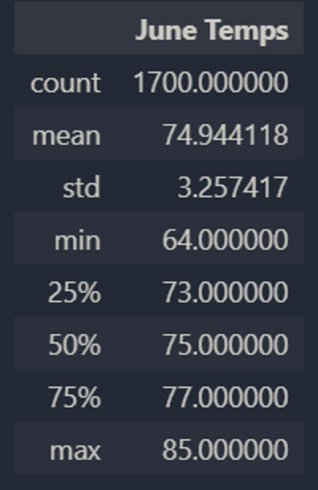
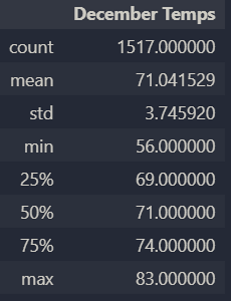

# Module 9 Challenge: Advanced Data Storage & Retrieval

## Overview

**Project name:** Surfs Up! Surfing & Ice Cream Shop, Oahu, HI

**Project sponsor:** W. Avy, Investor

**Project analyst:** B. Prentice

**Business case:** Analyze temperature data for June and December on Oahu to justify opening the surfing & ice cream shop.

**Problem:** W. Avy needs additional analysis to justify opening the shop to his Board of Directors.

**Goals:** Provide the necessary statistical data for W. Avy to convince his Board of Directors that opening the shop is a safe investment.

**Deliverables:** This analysis includes three (3) deliverables:

* Summary statistics for June

* Summary statistics for December

* This report

**Risks or Obstacles:** Some possible risks faced with this analysis are:

* Not enough temperature data to provide accurate statistics

* Temperature data may not be enough to justify the investment

## Results

The summary statistics for June and December:

**Major Points**

* The mean temperature is very similar in both months: 75 in June and 71 in December

* The maximum temperature is very similiar in both months: 85 in June versus 83 in December

* The greatest difference was in minimum temperatures: 64 in June, 56 in December

## Summary

Based on the temperature statistics, it appears that a surfing and ice cream shop would be welcome year round on Oahu. There is not much variation in mean temperature between summer (June) and winter (December), which bodes well for the shop. Oahu is a popular tourist destination for a reason: it's warm year round! Which means a whole lot of ice cream could be sold out of our shop after long days hitting the waves.

Returning to one of the risks mentioned above (that temperature data may not be enough), there are two additonal queries we could run that would make this analysis all the more valuable to W. Avy:

* A query of precipitation levels in June and December would provide insight into whether surfing and ice cream really do make sense at both times of the year. If December has higher precipitation levels, that could put a damper (pun absolutely intended) on investing in the shop. The query would look something like this:

`june_prcp = []
june_prcp = session.query(Measurement.prcp).filter(extract('month', Measurement.date) == '06').all()`

* A query of additional months would help flesh out the temperature and precipitation situation throughout the year, which would provide W. Avy and his Board of Directors with a more well-rounded understanding of the weather on Oahu. The query would look something like this:

`sept_temps = []
sept_temps = session.query(Measurement.tobs).filter(extract('month', Measurement.date) == '09').all()`
